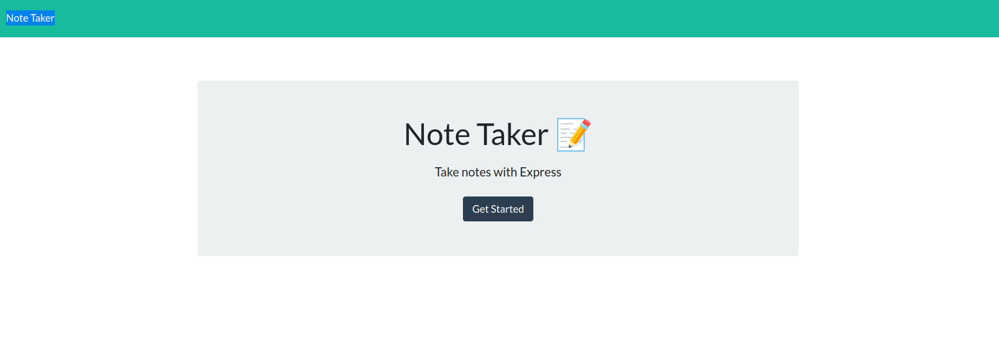
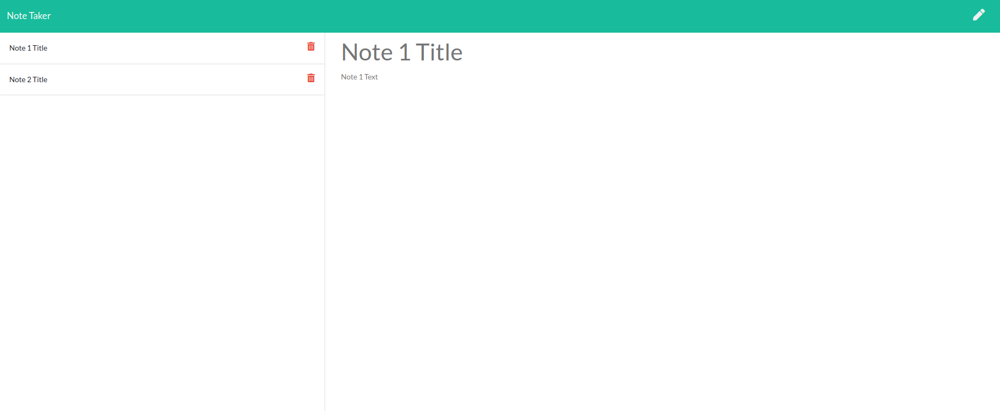

# note-taker


[](http://expressjs.com/)[](https://github.com/ericclemmons/if-env#readme)

[](https://nodemon.io)


## Description

Toy note taker application where I built the code to handle event handling for the page including note creation and deletion.

### Landing Page


### Notes Page


## Getting Started

These instructions will get you a copy of the project up and running on your local machine for development and testing purposes.

### Prerequisites

* [NodeJS](https://nodejs.org/en/)
* [Git](https://git-scm.com/)

### Installing

```
npm install
```

### Usage

```
npm start
```

## Authors

- Manuel Nunes (manuel_s_nunes@yahoo.com) [GitHub](https://github.com/redmarmaduke) [LinkedIn](https://www.linkedin.com/in/manuel-nunes-272ba31b/) 


## License

* 


